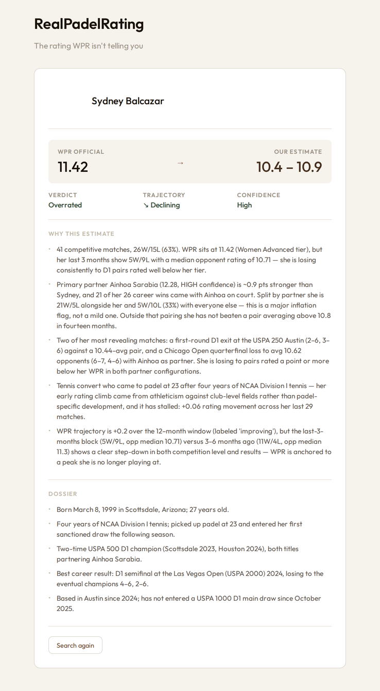

# RealPadelRating

**The rating WPR isn't telling you.**

RealPadelRating re-rates padel players by correcting their World Padel Rating (WPR)
for what a raw number hides — partner strength, regional rating inflation, and
racket-sport background — and returns a corrected estimate with a verdict,
trajectory, and confidence level.



## Stack

- **Runtime:** Bun + TypeScript
- **API:** Hono
- **Client:** Vite + React
- **Data:** Postgres + Drizzle (caches ratings & player backgrounds)
- **Sources:** World Padel Rating GraphQL API, Anthropic API, web search

## Running locally

```bash
bun install
cp .env.example .env    # fill in your keys
bun run dev:server      # API on :3001
bun run dev:client      # web UI
```

Requires `ANTHROPIC_API_KEY`, WPR credentials, and `DATABASE_URL` (see `.env.example`).

> The rating prompts (`src/prompts/`) are proprietary and not included in this repo.
